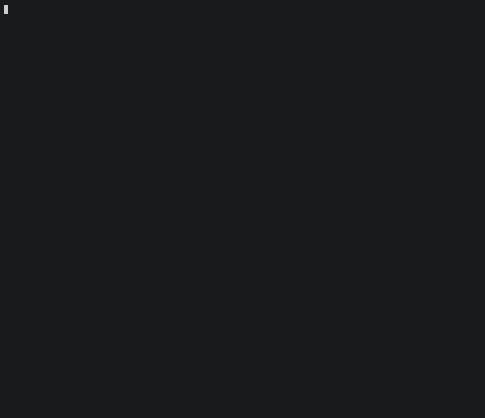

# agentdp

> [!NOTE]
> This is an experiment in building an agent platform. LLMs have been used in generating code, as such this is part slop.
> Lots of things have changed and been refactored since the "idea"-stage so things may seem at least in part incosistent.
> What I consider "good" in terms of design/architecture:
> - server agent runtime (runtime.rs and related code)
> - parts of core crate (manifests, desired state, plugin model etc.. The "pure" parts)
> - network crate (user-space network for MITM, policy, secret injection including the deterministic simulation testing harness)
>
> I have currently tested the latest state only on Linux. Been a while since I tested Windows and haven't tested macOS at all.

Agent developer platform for long-running, project-based software engineering agents.
Agents should be given full VMs (their PCs), full permissions, same tooling and knowledge/context as your human software engineers.
Example:
- QEMU for virtualization of full Arch Linux guest VM
- Codex CLI or other harnesses inside main tmux session as agent loop/harness
- Guest-side tooling for injecting external prompts/events into agent loop (e.g. GitHub PR CI failures, review comments)
- code-server (VSCode) as web-based "desktop environment"
  - Simple integrated browser
  - Terminal with agent access (`tmux a`)
  - Possible to use as personal remote devbox or fully autonomous agent depending on configuration

This platform should provide ultimate flexibility, both for agent-builders and agents themselves.

One note on implementation; lots of sandbox/agent tech is optimizing for boottime and scheduling, presumably because they view agents as short-lived or ephemeral.
That is not something I believe in currently, I've viewed the agent as durable and long-lived, working on tasks continuously and evolving its context, skills and toolset over time.
In that world, scheduling, boottimes, suspend/resume, fork and related concerns are not hard problems.
Some might say that with stateful, long-lived agents we now get pets as opposed to cattle, but I'd say that the agent would be the pet-owner in that case...



https://github.com/user-attachments/assets/4f0f7a27-5d3f-4a09-88cf-691574362c19


## Background

Lets say we believe AI is here to stay, and that AI agents are going to be part of the workforce of many/most organizations in the future.
In my case, I work in a team alongside software engineers and designers building a software product. So in that context agents could help with essentially 2 things:
- Speeding up development by letting agents complete tasks
- Improving quality by making use of the agents "intelligence"/knowledge

To do that and to do it efficiently the agents would have to operate more autonomously and with the same context and tools that
the human software engineers and designers have. So for this to work we obviously have to scale beyound individiual team members computers with manual approvals..
One could consider local sandbox as a stepping stone, but the one should be able to ship the sandbox to the cloud eventually if so.
Essentially we need agents to have their own computers with the same access to context/knowledge and tools (compiler, container runtime, browser, ...).

At this point one might consider this a build-or-buy decision.
Putting the software architect hat on, there are important decision drivers/questions:
- Is this core to the business? How important is it that we own this technology?
- How hard is it to build ourself? 

My chief complaint with all these cloud agent and sandbox companies relate to these two points. I think that, if the following is true:
- AI will lead to commoditization of software
- Agents will be a core part of the modern "AI native" organization

Then buying makes a lot less sense because the software is both a lot easier to build oneself and agents might be
important value-drivers in organizations, in that they represent increasinly large parts of production.
So if AI agents amplify the human output, it makes a lot of sense to own it, control it and make sure it gets integrated
in such a way that there is maximum flexibility and utility both in the short term and long term.

Think thinking brought me to creating this repo. My theory of course was that no.
I think a lot of these companies are composing building blocks out of already open source software.
There may be gaps, but then I believe and hope that the open source ecosystem can fill it.
So the question became:

> How little code is needed to get my personal little cloud agent going?

I thought that these were the essential, reusable building blocks for which there might be good open source software:
- Compute orchestration (Kubernetes, Nomad, ...)
- VM/VMM/sandboxing tech (QEMU, cloud-hypervisor, libkrun, firecracker, containers,  ...)
- Harness (Claude Code, Codex CLI or their SDK/app-server counterparts with essentially `--yolo` mode)
- Custom networking with policy engine and secret injection (?)
  - OK this was maybe not an existing thing, but thinking about it now it seems like it would be useful in other domains as well.. like CI systems

So the code in this repo tries to compose these building blocks into "cloud agents" in the form of "virtual softwar engineers" to run on
- My local dev machine (32 cores, 128GB RAM)
- Kubernetes in the cloud (just need the controller on top)

A very basic version of what is now in this repo took 2 full days to build. That was essentially a manifest-driven
way to describe and agent, the PC and its tools. Consted of a QEMU VM with Code Server for editor/IDE and Codex CLI in a tmux session,
with a little JS glue to poll github PR events into the tmux Codex CLI session through `send-keys`.

What followed were 2-3 weeks of afternoon work to try to get this looking more like an actual "agent developer platform",
which you are now free to explore here in this repository.


## TODO

- [ ] k8s controller, kind-cluster


## Features

Current:

- Agents provisioned and configured through "desired state" manifest descriptions of their environment: installed OS, tools, auth, plugins
- `agentctl` CLI for managing agents (ps, status, apply, delete)
- QEMU virtualization backend with cloud-init for first bootstrap (creates full vm for a given agent manifest)
  - Creates a base image with instance (depending on `replicas` in manifest) disks layered on top
- Guest-side daemon and CLI (`guestd`, `guestctl`) for control-plane/automation and agent tooling
  - GH PR listener/subscription manager for auto-prompting agent session based on GH PR events 
- Support Arch Linux and Rocky 9 as guest OS
- Plugins for `gh`, `codex`, `docker`, `mise`, `tailscale`, browser (including Playwright MCP) and more
- Custom network stack for MITM proxying, allowing "mediated auth", meaning your agent never sees secrets; only placeholders
  - Automatically inject and register MITM CAs with guest OS, docker/podman containers 
- OS-agnostic runtime, provisioning and guest-side modules to allow for future crossplatform support host- and guest-side for Windows, macOS and Linux
  - Windows and Linux tested host-side, only Linux guest-side

Planned:

- Support for multiple OSes both guest- and host-side; Windows, Linux distros, macOS (?)
- Support for multiple types of virtualization/runtime backends; QEMU, cloud-hypervisor, containers, lima, ...
- Richer reverse proxying for serving instance tools through stable per-agent/per-instance tailnet subdomains with host-header routing
- Richer web UI workflows for browsing manifests, creating instances, inspecting readiness, tailing logs, and managing route exposure
- Broader mediated networking policy and protocol support
- Kubernetes orchestration and efficient scheduling, i.e. k8s controller layered on top of server
  - Locally: 1 server manages N agents
  - Cloud: 1 controller schedules and orchestrates N pods each containing 1 server and 1 agent (server still wanted for automation)
- Guest-side plugin model
  - Could GH PR component in guestd become a plugin?


## Architecture

```
- src/    
  - apps/
    - agentdp-cli/          CLI frontend 
    - agentdp-guest         guestd (guest-side daemon) and guestctl (tool for agents to interact with certain tools)
    - agentdp-server        Agent manager/control-plane
  - backends/               Backend implementations for the sandbox
    - agentdp-qemu/         QEMU modules, e.g. QMP implementation
  - core/
    - agentdp-core/         Core domain models/types, e.g. manifest serialization/deserialization, cloud-init and guest OS config generation based on manifest, plugins etc
    - agentdp-protocol      Protocol types for IPC/integration between client<->server, server<->guestd (typically JSONL over UDS)
  - libs/                   Library/crate-things (TODO: perhaps a bit blurry in terms of core vs libs)
    - agentdp-base64        Base64 impl
    - agentdp-crypto        Integration points to rustls and related crates
    - agentdp-ds            Datastructures (spsc, ringbuffers, ...)
    - agentdp-network       Implementation of user-space networking stack based on the excellent smoltcp
    - agentdp-platform      Unified OS-level APIs for both host- and guest-side
    - agentdp-rand          PRNG
- tests/                    tests exercising public APIs only, preferred type of tests
  - agentdp-network-tests   Harness for deterministic simulation testing for the user-space networking stack (agentdp-network)
  - agentdp-test-support    Shared modules/fixtures for testing
```

### General

- Written in Rust
  - Great type-system, good for low-level as well as high-level programming, errors-as-values, doesn't lie
  - Strict clippy-linting, e.g. denied unsafe/expect as much as possible
- Layered to maximize reuse of building-blocks (e.g. server should be able to run locally on dev-machines and in k8s in cloud-context)
- Minimal use of dependencies
  - This has always been a good principle to have, even moreso now with AI agents being able to generate good code for well-scoped tasks where there are good references/specs (base64 as example)

- Threat model:
  - The host, host user, and local `agentdp-server` are trusted.
  - Agent guest trust is a user decision. A user may copy credentials into the guest and let the agent use them directly, or keep real credentials on the host and expose only placeholders through mediated networking.
  - Mediated networking is the stricter mode: guests receive placeholders, real host secrets stay on the host, and the host substitutes them only for allowed destinations.
  - External network destinations are untrusted unless allowed by manifest policy.
  - Other local OS users are not the primary threat model for local development, but state and socket paths should still avoid accidental disclosure, collisions, and stale-resource failures.
  - Host-side persistence of runtime state is acceptable for local development when owned by the trusted user.


### Operator-pattern

Based on ideas from Kubernetes, which in turn is based on control-theory (think PID-loops and whatnot),
this is a good pattern for creating self-healing processes that are able to function independently and build automations.
Should be used across controller, server, guestd.

The [agent/runtime.rs](src/apps/agentdp-server/src/agent/runtime.rs) module is implemented as such,
essentially a controller loop with state machines and long-running work spawned as async tasks (e.g. bootstrapping a QEMU VM).
The idea was that this would mesh well with the k8s deployment eventually and that we could easily automate things such as disk resizing, automated sleep etc..
It could also be self-healing in the case of crashes.


### OS-specifics

Given the goals of (theoretically) supporting Windows, macOS and Linux both host- and guest-side,
I try to create unified APIs in the platform crate, while still having e.g. guest-specific OS submodule layers where it makes sense.


### Network

The network crate is the main/scariest part of the "data plane" of this project, directly interacting with guest/agent network traffic on (OSI L2-L3 upto 7 currently for the QEMU transport).
Here I have about as much testing code as I have source code, where all impurity is injected as part of "NetworkRuntime" capabilities (reactor backend, clock, ...).
The core of it is an eventloop orchestrating smoltcp as a virtual device/gateway consuming and emitting ethernet frames from and to the guest transport.
There are also benchmarks measuring ~2-4 gbps no my machine, which is pretty terrible considering iperf as a pipeline reaches 100+ gbps. Work to be done here, including on mem allocation strategy.


### Concurrency

- Tokio single-thread runtime where async is used (basically anywhere but network crate)
- Hand-rolled eventloop + statemachines in network crate (needs determinism, as such it doesnt assume anything about execution context/environment)
- Rc and RefCell over Arc and Mutex
  - lots of datastructures are simple to make a lot more performant, e.g. custom spsc over std/tokio mpsc (see ds crate)


### Testing

- Integration-level testing preferred (independent from implementation details)
  - Calling CLIs, UDS/JSON protocol, deterministic simulation testing of network
- Miri for unsafe/UB
- Loom for testing concurrent permutations (different interleavings and reentrancy)
- cargo-mutants (?)
- Benchmarks and allocations tests for hard perf invariants (e.g. dataplane part of network crate)
- Unittesting for invariants that arent easily tested on the integration-level


#### IPC

Mostly chosen JSONL over Unix Domain Sockets, as it is supported on all Windows 11 versions even (unified API in platform-crate).
